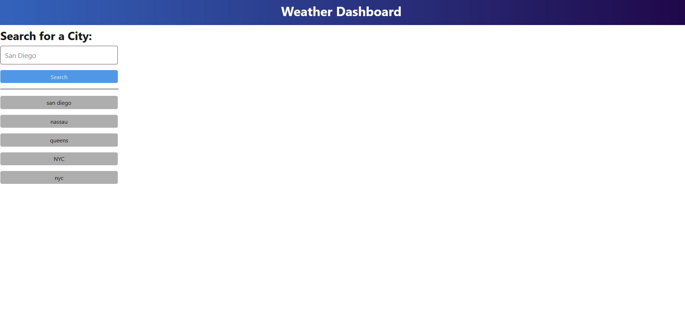
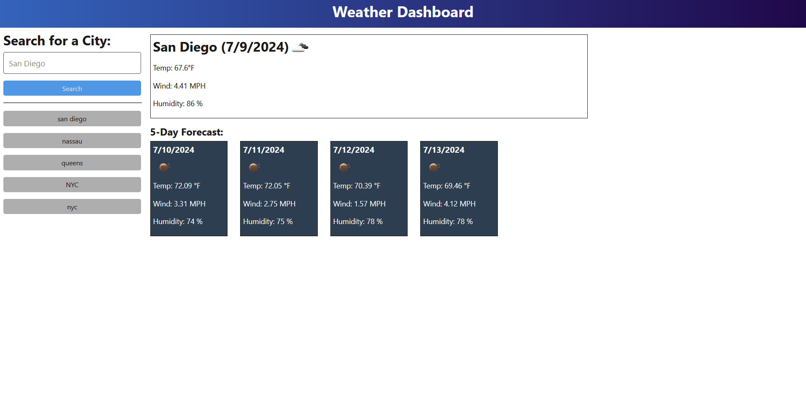

# Weather_Dashboard-06
Weather Dashboard with server-side API

## Description

This is a single page application with the purpose of integrating third-party server-side API so that requests can be made for data to be retrieved and presented for our use.

By using [5 Day Weather Forecast](https://openweathermap.org/forecast5) as a source, we can utilize the data in conjunction with `local storage` data to present a weather dashboard for our user.

## Usage

This application is intended to create a weather dashboard for a traveler; so that they can see the weather outlook for multiple cities across a 5 day forecast.

After they search for a city, they are presented with current and future weather conditions in that city and the city is added to the search history so that they can review as needed. 

The city name, date, icon of weather condition, temperature, humidity, and wind speed are visible. In addition they can see the 5-day forecast that displays the date, weather condition icon, temperature, wind speed, and humidity.

## License

MIT License

Copyright (c) [2024] [Stephen Wei]

Permission is hereby granted, free of charge, to any person obtaining a copy
of this software and associated documentation files (the "Software"), to deal
in the Software without restriction, including without limitation the rights
to use, copy, modify, merge, publish, distribute, sublicense, and/or sell
copies of the Software, and to permit persons to whom the Software is
furnished to do so, subject to the following conditions:

The above copyright notice and this permission notice shall be included in all
copies or substantial portions of the Software.

THE SOFTWARE IS PROVIDED "AS IS", WITHOUT WARRANTY OF ANY KIND, EXPRESS OR
IMPLIED, INCLUDING BUT NOT LIMITED TO THE WARRANTIES OF MERCHANTABILITY,
FITNESS FOR A PARTICULAR PURPOSE AND NONINFRINGEMENT. IN NO EVENT SHALL THE
AUTHORS OR COPYRIGHT HOLDERS BE LIABLE FOR ANY CLAIM, DAMAGES OR OTHER
LIABILITY, WHETHER IN AN ACTION OF CONTRACT, TORT OR OTHERWISE, ARISING FROM,
OUT OF OR IN CONNECTION WITH THE SOFTWARE OR THE USE OR OTHER DEALINGS IN THE
SOFTWARE.